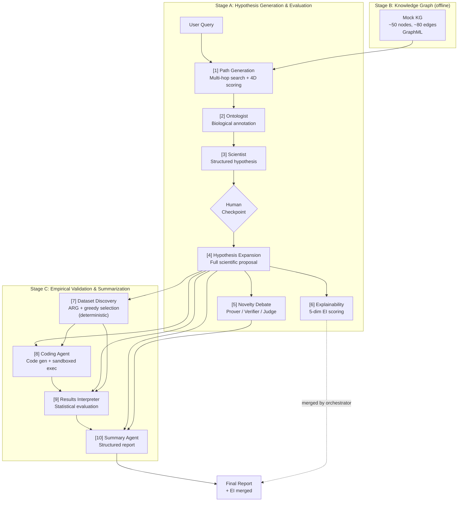

# SAGE — Agentic Framework for Biomarker Discovery

Architecture-level reproduction of [SAGE](https://arxiv.org/abs/2602.00953v2): a fixed-serial multi-agent system that connects knowledge graph reasoning, adversarial novelty debate, explainability scoring, and automated statistical validation into a single pipeline for interpretable biomarker discovery.

## Architecture



## Agent-to-Paper Mapping

| # | Agent | Paper Section | Model Tier | Key Responsibility |
|---|-------|--------------|------------|-------------------|
| 1 | Path Generation | 3.1, A.4 | Lightweight | Multi-hop KG search + Novelty/Surprise/Logic/Relevance scoring |
| 2 | Ontologist | 3.2 para 2 | Mid | Map graph symbols to biological definitions |
| 3 | Scientist | 3.2 para 3 | Strong | Generate validation-aware structured hypotheses |
| 4 | Hypothesis Expansion | 3.2 para 3 | Mid | Expand to full scientific proposal (pipeline trunk document) |
| 5 | Novelty Debate | 3.2.1, B.4 | Mid x3 | Game-theoretic 3-role debate with sigma-triggered rounds |
| 6 | Explainability | 3.2.2 | Mid | 5-dimension EI index (MD/CP/SBC/CT/MT, 0-10) |
| 7 | Dataset Discovery | 3.3.1 | **No LLM** | Deterministic ARG + greedy file selection |
| 8 | Coding Agent | 3.3.2 | Strong | Code generation + subprocess execution + repair loop |
| 9 | Results Interpreter | 3.3.3 | Strong | Statistical evidence evaluation |
| 10 | Summary | 3.3.3 | Mid | Structured research report |

## Quick Start

```bash
# Install dependencies
pip install -r requirements.txt

# Set API key
export OPENAI_API_KEY="sk-..."

# Run the full pipeline
python -m sage.main --query "prognostic biomarkers for bladder cancer survival"
```

The pipeline auto-generates the mock KG and data bank on first run. Use `--auto-approve` (default) to skip the human checkpoint.

## MemoryStore ACL (Context Allocation)

Each agent reads only its authorized context sources (Paper Table 7):

| Agent | Reads | Excludes |
|-------|-------|----------|
| Path Generation | `__user_query__` | -- |
| Ontologist | `path_generation` | User query |
| Scientist | `ontologist` | Path Generation |
| Hypothesis Expansion | `scientist`, `ontologist` | Path Generation |
| Novelty Debate | `hypothesis_expansion` | All upstream |
| Explainability | `hypothesis_expansion` | All upstream |
| Dataset Discovery | `hypothesis_expansion` | All upstream |
| Coding | `hypothesis_expansion`, `dataset_discovery` | All upstream conceptual |
| Results Interpreter | `hypothesis_expansion`, `coding`, `dataset_discovery` | Upstream conceptual |
| Summary | `results_interpreter`, `hypothesis_expansion`, `novelty_debate` | Coding, upstream conceptual |

## Project Structure

```
sage/
├── main.py                     # E2E pipeline orchestrator
├── config.py                   # Global configuration
├── memory_store.py             # Central dict + ACL (Paper Table 7)
├── llm.py                      # Unified OpenAI API wrapper
├── mock_kg.py                  # ~50 node mock Knowledge Graph (GraphML)
├── mock_data_bank.py           # Synthetic CSV generator (100 patients)
├── agents/
│   ├── base.py                 # BaseAgent abstract class
│   ├── path_generation.py      # [1] Multi-hop search + 4D scoring
│   ├── ontologist.py           # [2] Biological annotation
│   ├── scientist.py            # [3] Structured hypothesis + checkpoint
│   ├── hypothesis_expansion.py # [4] Full scientific proposal
│   ├── novelty_debate.py       # [5] Prover/Verifier/Judge debate
│   ├── explainability.py       # [6] 5-dim EI scoring
│   ├── dataset_discovery.py    # [7] Deterministic ARG + greedy select
│   ├── coding.py               # [8] Code gen + exec + repair
│   ├── results_interpreter.py  # [9] Statistical evaluation
│   └── summary.py              # [10] Research report
├── data/
│   ├── mock_kg.graphml         # Generated KG
│   └── data_bank/              # Generated CSVs
├── outputs/                    # Pipeline output (final_report.json)
└── verify/                     # Per-spec verification scripts
```
